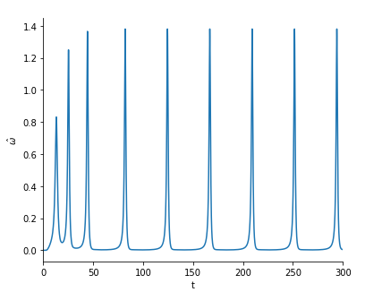
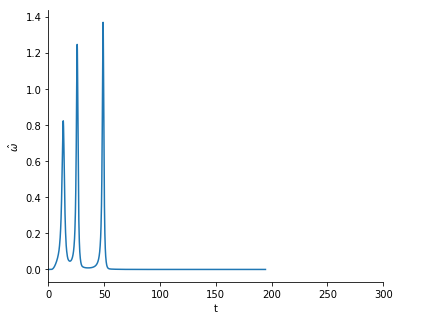

## Use HPC for all works
Use my credentials
```
ssh -X dingzhiz@qb1.loni.org
pw: Happywork*890418
```
* Go to the folder
```
cd /work/dingzhiz/ellipse/c_Re
```
* run python file
```
python gen_cases_Re.py
```
* submit jobs
```
bash runall.sh
```

## Loni checks
* `qstat` check the status of submitted jobs

* [QB documentation](http://www.hpc.lsu.edu/docs/guides.php?system=QB2) FYI

## Goal:
Find all critical Re for all different scenarios, and fill out the `c_Re` sheet in the `Rigorous_plan.xlsx`

The Reynolds number listed in the python file are just priliminary guess, after you run the cases, you should be able to fine tune Re to get critical Re for all cases.

Keep all files generated intact in HPC (don't make changes to any of them), you can download `cloud.out` file to your local folders and check the time series data with the processing python file `oneFile.py`. After opening it with SPYDER, Your just need to hit `F5` to run, and copy the absolute path to the command window, then the figure will show.

Critical Re is defined as the threshold where the particle stops rotating. So in time series figure, last time it shows a periodical angular velocity, next time it shows a straight line for angular velocity as shown below.

The left picture's Re is 7.2, right one is 7.4, so we know the critical Re should be 7.3




## Note
* Precision requires at least 1 decimal place. e.g. `7.3`  
* It takes roughly two days for one case to finish, so plan your time wisely, I need the all results by **next Thursday(09/19)**.
* If you have any questions like unable to sumbit jobs or unable to run python files, ask me asap.
