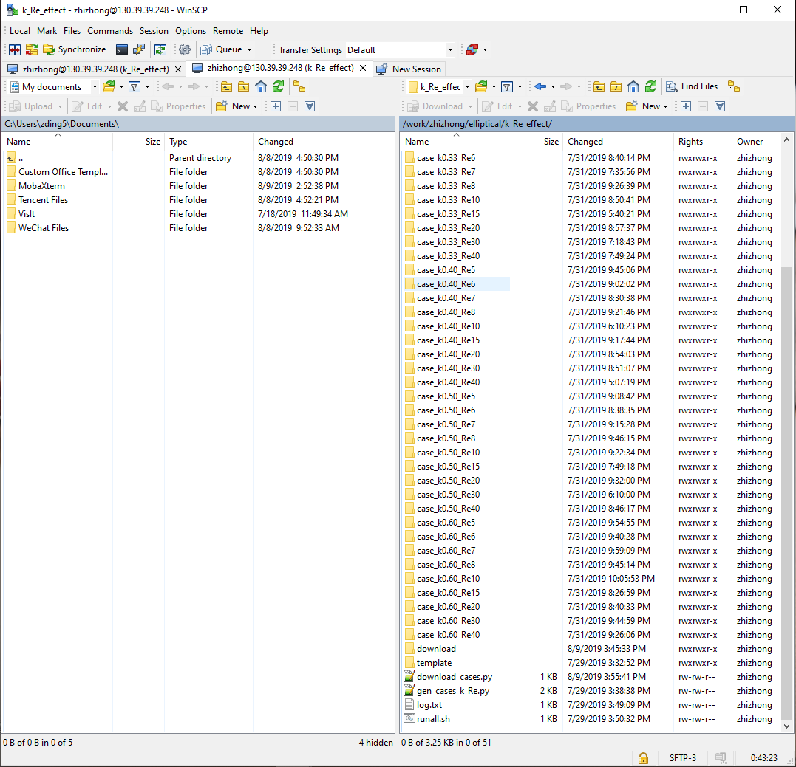

## Steps to auto download files to local machine
1. Use winscp to go to the selected folder
2. delete download folder if it's already existed
```
rm -r download
```

3. run download.py
```
cd ..
python download.py
```

5. download everything in `download` folder to local folder
